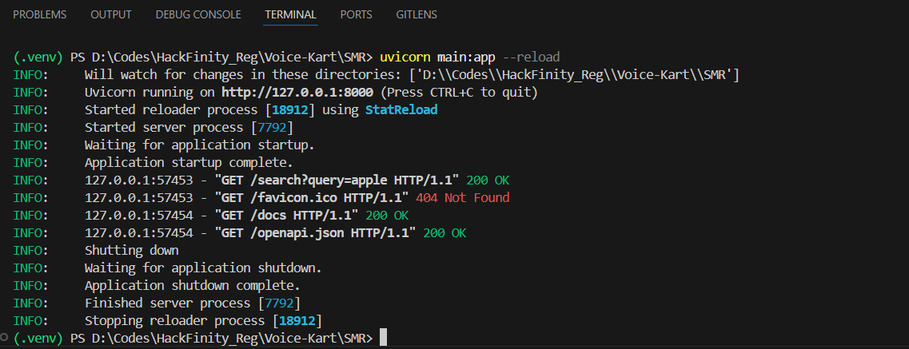
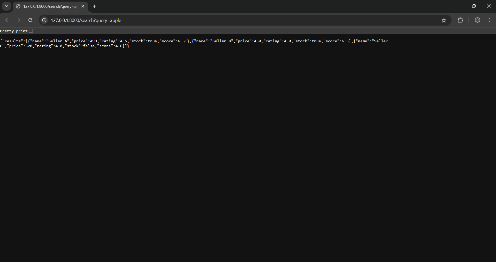

# Smart Marketplace Router (SMR) :

# Code :

main.py :

```
from fastapi import FastAPI, Query
from typing import List
from services.routers import route_query

app = FastAPI()

@app.get("/search")
def search_items(query: str = Query(...)):
    results = route_query(query)
    return {"results":results}
```

services:

routers.py:

```
import requests
from utils.sellers import get_sellers
from utils.scoring import score_sellers

def route_query(query: str):
    sellers = get_sellers(query)
    scored = score_sellers(sellers)
    return sorted(scored, key=lambda x: x['score'], reverse=True)
```

utils :

sellers.py :

```
def get_sellers(query: str):
    # Dummy mock data
    return [
        {"name": "Seller A", "price": 499, "rating": 4.5, "stock": True},
        {"name": "Seller B", "price": 450, "rating": 4.0, "stock": True},
        {"name": "Seller C", "price": 520, "rating": 4.8, "stock": False}
    ]
```

scoring.py :

```
def score_sellers(sellers):
    scored_list = []
    for s in sellers:
        score = 0
        score += (5 - s['price'] / 100)  # lower price = higher score
        score += s['rating']
        if s['stock']:
            score += 2
        scored_list.append({**s, "score": round(score, 2)})
    return scored_list
```
# Output :

Terminal :



Browser :

